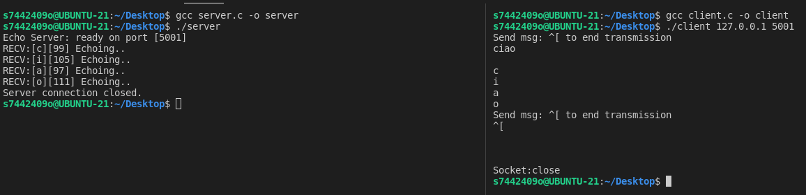
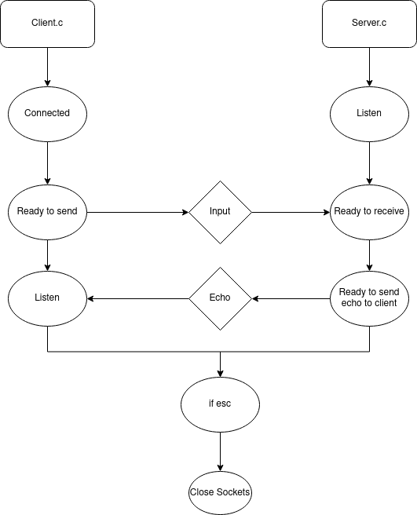

# **Relazione Tecnica - Socket Client**
**Conedera Jarno - Lampugnano Matteo - 5AIT**

> ## **Indice**


>1) [Definizione del problema](#1-definizione-del-problema)
>2) [Codice](#2-codice)
>3) [Testing](#3-testing)
>4) [Criticità](#4-criticità)
>5) [Architettura](#5-architettura)
>6) [Conclusioni](#6-conclusioni)

_ _ _

<br/><br/>

> ### **Consegna**

### - Codice in C commentato in doxygen
### - Makefile per l'esecuzione del programma
### - Relazione
### - Diagramma di flusso 
### - Definizione funzioni e chiamate di sistema

<br/><br/>

# *1) Definizione del problema*

### L'obiettivo dell'esercitazione è l'implementazione di un prompt interattivo che simuli il Client Telnet. Oltre alla creazione del file *"Client.echo.c"*, verrà utilizzato *"Server.echo.c"*, creato precedentemente per simulare il lato server.
 <br/><br/>

 # *2) Codice*

 ### 1) Implementazione dei define e degli include
```c
#include <stdio.h>
#include <stdlib.h>
#include <string.h>

#include <errno.h>
#include <unistd.h>

#include <sys/time.h>
#include <sys/types.h>
#include <sys/socket.h>

#include <arpa/inet.h>
#include <netinet/in.h>

#define PORT 5001 // server port
#define SOCKET_ERROR ((int)-1) // error code conversion
#define END_RECV 27 // ASCII value for escape character (esc)
#define RETURN_CHAR 10
#define RETURN 13 //define tasto invio
#define MAX_PROMPT_LENGTH 200 //define lunghezza massima delle stringhe
```
### 2) Inizializzazione funzione void e varie stringhe
```c
void telnetClient(int in,int out) //inizializzazione funzione telnet
{
    // input string:
    char * prompt = malloc(MAX_PROMPT_LENGTH); //istanza malloc contenente stringhe
    char prompted, recvChar;
    int len, asciiVal;
```
### 3) Ciclo per inserimento di stringhe a terminale
```c
do 
    {
        printf("Send msg: ^[ to end transmission\n"); //stampa messaggio per chiusura della transmissione
        fgets(prompt,MAX_PROMPT_LENGTH,stdin); //riceve dati in input (sostituito alla scanf)
```		
### 4) Ciclo for che serve per prendere in input da terminale, scrivendo al server.
### Una volta mandata la stringa al server, il client aspetta di ricevere una risposta (echo)
### Con il printf, stampa il carattere ricevuto.

```c
for (int i = 0; i < (strlen(prompt)+1) ; i++) //ciclo while
        {
            // ** from prompt
            char prompted = prompt[i] ;
            if(prompted!= RETURN_CHAR && prompted!=RETURN){
            // ** write to server something
            write(in, &prompted,1);
            // ** wait for the answer from the server
            read(in, &recvChar,1);
           
           printf("\n%c",recvChar);  //stampa il carattere ricevuto
           fflush(stdout);      
        }
        }
```
### 5) Inizializzazione funzione main.
```c
int main(int argc, char *argv[]) { //inizializzazione funzione main

    if (argc < 3) {
        fprintf(stderr, "Usage: %s <server ip> <server port>\n", argv[0]); //errore
        exit(1);
    }
```
### 6) Informazioni sul server
```c
// Server INFO
    char * serverAddress = argv[1];
   //int serverPort = SERVER_PORT;
    int serverPort = atoi(argv[2]); // FIXME: Warning

    int recvChar;                        // last recv"d char
    struct sockaddr_in clientConf, serverConf;    // socket data structures
    int socketClient, socketServer;                // socket identifier
```
### 7) Determinazione impostazioni di Client e Server
```c
    clientConf.sin_family = AF_INET;    
    clientConf.sin_addr.s_addr = htonl(INADDR_ANY);
    clientConf.sin_port = htons(0);

    /** bind address to transport endpoint */
    /** error management: notify the user if something goes horribly wrong */
    if (bind( socketClient,(struct sockaddr *)&clientConf, sizeof(clientConf))==-1) //bind con tra client e server
    {
        printf("\nErrore durante il bind\n"); //stampa errore bind
        /*
        gestione errore
        */
       return SOCKET_ERROR;
    }
    /**
     * @brief 
     * Determinazione impostazioni del server 
     */
    serverConf.sin_family = AF_INET ;
    serverConf.sin_addr.s_addr = inet_addr(serverAddress );
    serverConf.sin_port = htons(serverPort );
```
### 8) Determina qualora il Client si possa connettere al Server. In caso non fosse possibile, viene stampato un errore
  ```c
  if ((socketServer = connect( socketClient,(struct sockaddr *)&serverConf, sizeof(serverConf))) == SOCKET_ERROR) {  //permette la connessione di client al socket
        
        printf("\nErrore durante la connect\n"); //errore
        exit(EXIT_FAILURE);
    }
```
### 9) Chiusura dei sockets, Client e Server, con stampa di messaggio che comunica testuali azioni.
```c
 printf("\n1Socket:close \n"); //messaggio che comunica la chiusura del socket
    fflush(stdout);
    close(socketClient);    //chiude socketClient
    close(socketServer);    //chiude socketServer
    return (0);
}
```


# *3) Testing*

### Per la corretta esecuzione del codice,sarà necessaria, per prima cosa, aprire un terminale diviso.
### Il primo file che deve essere compilato ed avviato è il server, così che sia possibile per il client, connettersi.
### Dopodichè sara necessario fare lo stesso con il client. 
### Per questi procedimenti è stato realizzato un makefile.


```c
makebuildserver:
	
	gcc server.c -o server 

runserver:

	./server               

makebuildclient:
    
	gcc client.c -o client 

runclient:
	
	./client 127.0.0.1 5001 
```
### Dopo aver completato l'esecuzione del codice, per uscire dal terminale è necessario premere il tasto "Escape" 
<br/><br/>

### Una raffigurazione del terminale
<br/><br/>

# *4) Criticità*
### Nel codice di partenza sono stati notati alcuni errori, prevalentemente nel ciclo.
### Una funzione che non permetteva la corretta esecuzione del codice.
### Sostituzione di una scanf con un fgets, per ottimizzare l'utilizzo di stringhe.
### C'è stata anche la necessità di rivedere alcune cose nel server creato precedentemente.
### É stato necessario provvedere all'utilizzo di stringhe con la funzione "strlen", determinandone la dimensione.
### Sono stati cambiati gli attributi di "write" e "read".
### Implementare la corretta chiusura dei socket ha richiesto più tempo del previsto.
### Lieve modifica del messaggio ricevuto dopo la chiusura dei socket


<br/><br/>


# *5) Architettura*
### Per rappresentare l'architettura è stato realizzato un diagramma di flusso.

<br/><br/>


# *6) Conclusioni*

### L'esercitazione è stata svolta sviluppando una sorta di architettura Client-Server, utilizzando il server creato precedentemente ed un Client.
### L'utilità principale è stato il dover gestire le interazioni tra server e client e dei loro attributi.